[Grove](https://grovegrown.com) was my life from the beginning of 2014 until the end of June 2016. Over the course of that time I was a key member of a small, tight-knit team that designed, manufactured, and shipped two generations of beautiful, "smart", indoor aquaponic gardens. We sold and supported large hardware systems that cost between $1,000 and $4,5000 to over 200 customers, teaching and guiding each of them how to steward a living, productive ecosystem in their home.

I architected the software behind the two products — a distributed system comprised of connected embedded systems, web and native apps, and a real-time back-end. I was the lead software engineer and co-product manager with our UX designer, Liz Cormack. More details about the choices and challenges of making those systems are in [Making the software, round 1](#making-the-software-round-1) and [Making the software, round 2](#making-the-software-round-2).

In addition to the software powering our products, I built internal dashboards, created marketing and commerce websites, setup and moderated our online community, and managed the company's generic IT services. I helped craft and execute technical marketing strategies, including a successful [Kickstarter campaign](#kickstarter). I played a pivotal role in recruiting, team culture, and corporate governance. I was also the [head of sales and strategy](#sales) for my last few months at the company.

<figure>

<figcaption>
A beautiful Grove Ecosystem
</figcaption>
</figure>

# The beginning

I joined Grove during the January of my senior year of college. They had just moved into a space at the new [Greentown Labs](https://www.greentownlabs.com/) location in Somerville, MA, and were in the midst of the [RGA Connected Devices accelerator](http://rgaaccelerator.com/connecteddevices/) in New York City. I joined the company after hearing my good friend and fraternity brother Chad Bean talk it up for a few months. He was their electrical engineer and one of only four or five people who worked for the company. Grove had been created during the prior year and gone through MIT's Global Founder Skills Accelerator (now [_delta v_](http://entrepreneurship.mit.edu/accelerator/)) program that summer. Chad had been working with them for the fall semester and mentioned that they were hiring folks for IAP, MIT's January term. I had been inspired to work for a consumer hardware startup after attending a talk by Eric Migicovsky, the founder of Pebble, that fall, and was focused on finding one to work at after graduation.

Several other new people worked for Grove that January, effectively tripling the number of people who had ever worked for the company at one time. Those four weeks were a jam-packed sprint. We worked on everything from building an indoor research farm inside of a warehouse, to interviewing indoor farmers all around New England, to writing Python for sensors hooked up to Raspberry Pi computers, to designing an automatic fish feeder, to creating the beginnings of an API for internet-connected sensors, and more. Gabe Blanchet & Dave Bowker, the CEO & head of operations, respectively, were in full swing with the RGA accelerator, living in an apartment in New York half of the time.

The first role I had at Grove was "Lead Community Engineer." I was told that the other software engineer on the team, Kenny Siebert, was handling the whole back-end and I was responsible for crafting a vision of how we would bring together people from all of the communities that may be interested in Grove.

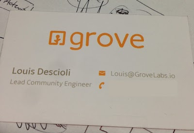

Creating community is fundamentally about understanding culture, so for much of that first month I set about learning the culture of farming, food, and agriculture. We already had a small company library, so I read my way through a few of the titles such as _The Omnivore's Dilemma_, _In Defense of Food_, _Teaming with Microbes_, _The Essential Urban Farmer_, and _The Vertical Farm_, and watched some documentaries on the food industry, such as _Food, Inc._, _Forks Over Knives_, and _King Corn_. Up until this point in my life I was blissfully unaware about how my food arrived at my table and the costs that our food systems were having on the Earth. That abruptly changed.

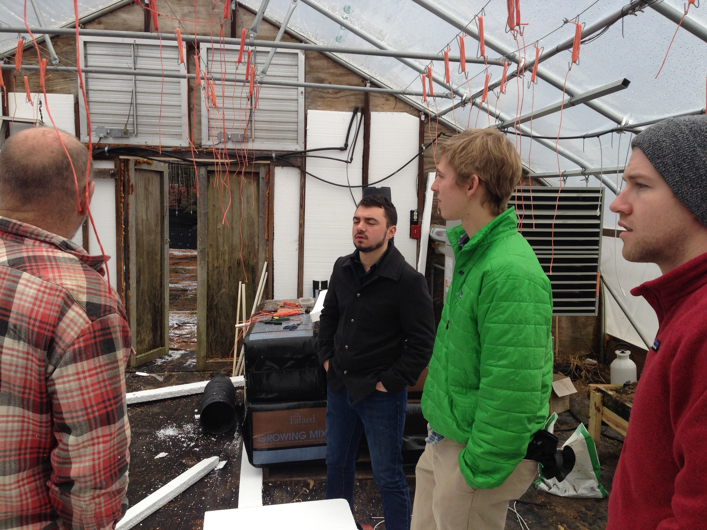

That month was a hodgepodge of development. We felt like were doing so much! But only a fraction of what we did that month contributed much to the future of the company. We were a group of young and eager engineers and designers, given a bit of direction and a whole lot of empowerment and inspiration to go do **something** to help this small company progress. The nice thing about working with highly competent and motivated people is that simple direction like that can be surprisingly productive. Or at least give a good appearance of it.

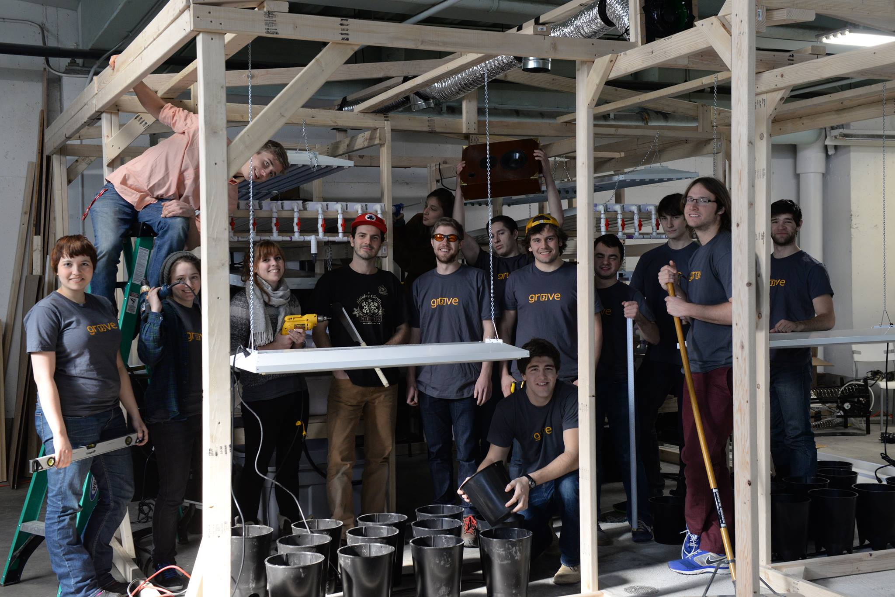

# Farmers or gardeners?

The [original pitch](https://vimeo.com/100816582) that Gabe and Jamie made for Grove when they founded the company was for a personal indoor farming appliance. Gabe begins his presentation with an incredibly bold claim — _In five years you're going to be able to grow half of your own food inside of your house_. He goes on to show a physical prototype of a product called the "Cortex" and discusses a brief plan for developing sensor and data technology for indoor farms, but he ends his pitch where it began. He shows a glimpse of the real dream — a "modular home farming appliance the size of a bookshelf"; an appliance that will be "as ubiquitous in people's homes as refrigerators or microwaves."

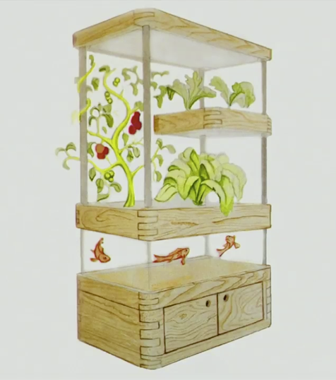

While the company would try developing sensor technology for indoor farms for the next year, it was always the consumer appliance idea that garnered the most interest from investors, employees, and the general public. We would end up scrapping all of the work that we'd done on the greehouse technology product, pivoting that May when we got our first round of funding.

# Funded

When I graduated that June, Gabe had just secured the company's seed round for a little over $2 million, and I had just been promoted. Kenny had decided that he was not interested in staying on after graduation, instead choosing to focus on his Masters degree. Gabe offered me the position of Software Lead and a whopping 5% stake in the company. I was way too idealistic to be skeptical of the terms on the options. I would get paid enough to make rent and starting paying off my student loans, and maybe my hard work and execution on this crazy dream would make me a millionaire. Or maybe I would just get to learn a lot of what I wanted to, working on something meaningful with my own team. I was beyond thrilled.

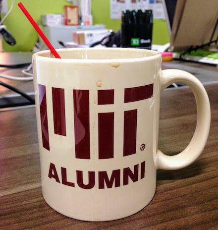

Flush with cash, full of enthusiasm, and fresh from sipping from the MIT firehose, we embarked on growing the company and producing the first batch of prototypes of a home gardening appliance. I set about figuring out how to recruit people for software and began my deep-dive on all of the parts of the puzzle of making a system of smart indoor gardens.

We had a lot of fun and a little bit of failure that summer. We started out the summer with five full-time employees and four or five interns. We grew to ten full-time employees by the summer's end. Emily Malkin, Liz Cormack, Brooks Eaton, and Nate Williams joined the company, all of whom became essential teammates and close friends. We had an engineer, Andrew, quit in frustration after Gabe and I bungled a conflict that started from a disagreement over which software framework the company should use.

I stumbled my way through my first time being on the other side of an interview and began to understand how difficult it is evaluate someone's competency and trustworthiness from just a couple brief meetings. I hired my friend and classmate, Michael Sanders.

We went on our first company retreat, fleshed out the research farm, started our tradition of having [#grovegrown](http://instagram.com/explore/tags/grovegrown) lunch every week, and made fun videos about the importance of culture.

https://www.youtube.com/watch?v=0os7_w4i1Og

For almost everyone in the company, Grove was our first paid full-time job in these roles. We were basically the same age as our interns. Emily had just graduated. Liz was on her own as a designer for the first time. Nate would leave college early to come work at Grove full-time (and would turn out to possibly be one of the best home aquaponics designers in North America).

Most visibly, we produced our first batch of prototype appliances — simple, un-connected, plumbing-free hydroponic gardens.

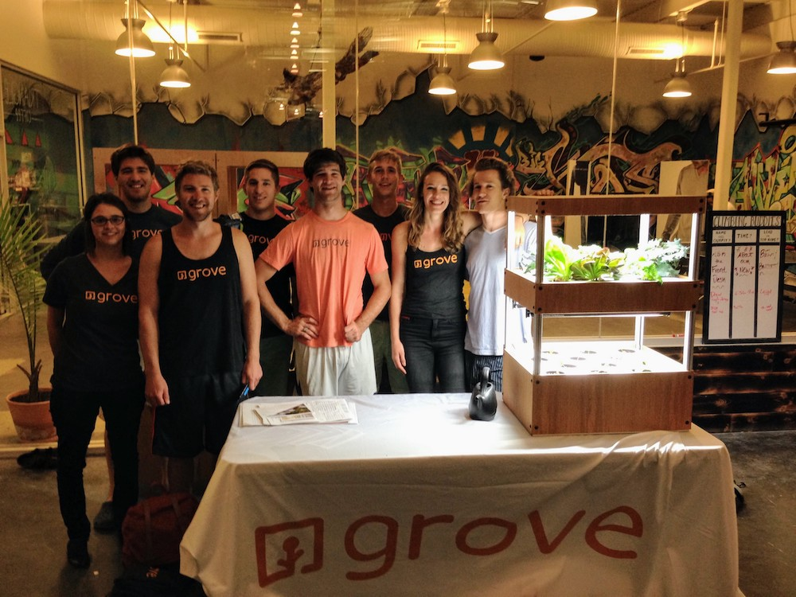

# The Early Adopter Program

As we moved into the fall we began work on a new appliance design. This one was to look very similar to the early sketches. It would have custom electronics and lighting, be connected to the internet, use aquaponics instead of hydroponics, and be made of wood. The plan was to sell this version to a limited number of people in the local area so we could manufacture and distribute the product ourselves. This would enable us to practice the principles of a "lean startup" and lean manufacturing — building iteratively, finding points of failure as they happen, and solving issues quickly and early.

We hired more people. Tim Day joined the company, an Australian ecologist who had actually practiced aquaponics professionally. I hired Abigail, a software engineer that found us through the Meteor community. She was the first person I hired whom I didn't already know. And we hired Carol, our first full-time marketer.

We went about finding customers through hosting open houses at our office, putting prototypes in a couple local businesses, and speaking at various food and tech events. We began to get some press attention, getting a segment in [the local news](http://www.wcvb.com/article/team-bringing-fresh-food-gardens-to-high-rises-near-you/8049206) and an article on [The Verge](https://www.theverge.com/2014/11/18/7242771/grove-labs-wants-to-put-a-tiny-farm-in-your-kitchen). Gabe and Jamie also received some flashy accolades that fall when they were selected as [Forbes 30 under 30](https://www.forbes.com/pictures/ehde45ekmdk/gabe-blanchet-23-jamie-byron-23/#79a3f47830bb) and [Kairos 50](https://www.gettyimages.com/event/kairos-global-summit-2014-518954671#grove-labs-cofounders-jamie-byron-and-gabe-blanchet-attend-the-2014-picture-id457450768), both annual lists of promising young people. The fact that we hadn't shipped anything yet apparently didn't matter; the seeming magic and good looks of the prototypes, combined with their rhetoric and the "made by MIT engineers" pedigree, was enough. We hit our goal and sold about 100 units to fifty people that fall and winter, for around $1,000 each.

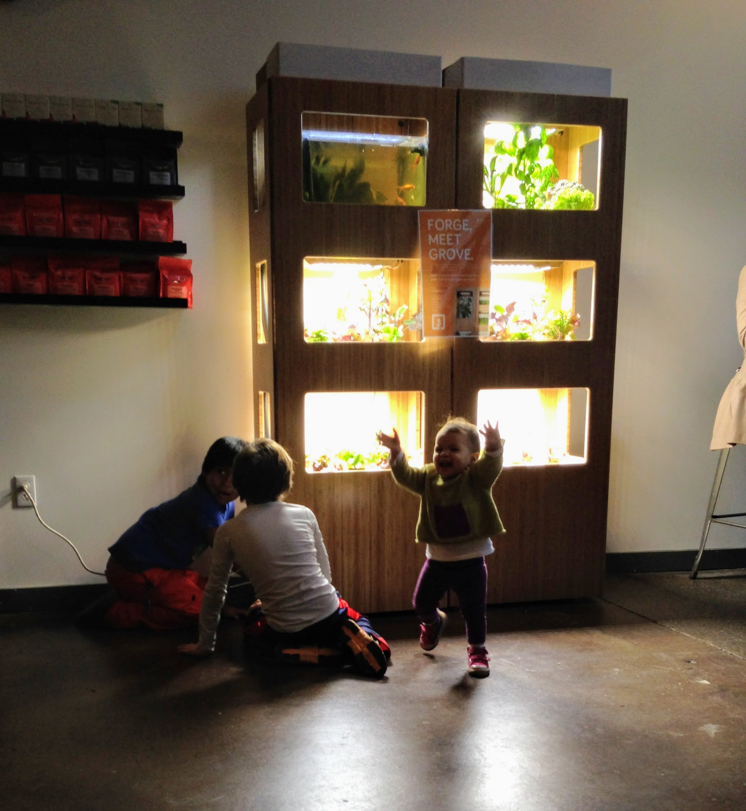

# The insane Boston winter of 2015

That winter we threw ourselves into our work. And the winter threw itself onto us. That year was Boston's [snowiest winter on record](https://weather.com/news/news/new-england-boston-record-snow-tracker). Snow came down in feet, not inches. We witnessed two of the top ten snowiest storms in Boston less than two weeks apart. Walkways were cut through snow mounds that were five, six, seven feet tall. Going outside resembled more of an arctic zombie apocalypse than walking through a bustling city.

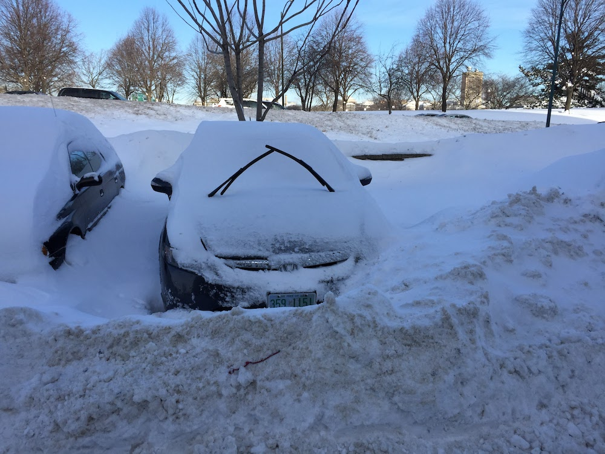

Work was like an oasis. The GURF — the **G**rove **U**rban **R**esearch **F**arm — was filled with life and light. My breaks consisted of walks back to the farm to help out, and to harvest. One of my favorite activities was making lunch with fresh food harvested from the GURF, usually with someone else on the team. The act of deciding and executing on something as simple as lunch helps strengthen trust and relationships. Sharing in the of growing, preparation, and eating of good food was one of my favorite parts of Grove's culture.

Those winter months saw more solid growth. We had accomplished interns from MIT's business school. Nick came on full-time after graduating. We hired Mike Zartarian, a veteran electrical engineer, whom Chad and I met after I gave a one minute pitch I gave at the end of a Boston Hardware Startup Meetup event. Mike brought along Mike Siegel and Karl Henricksen, an excellent embedded systems engineer and test engineer, respectively. The three of them had far more experience in shipping a consumer electronics product to paying customers than anyone within the company. They brought a new level of quality and stability to the team.

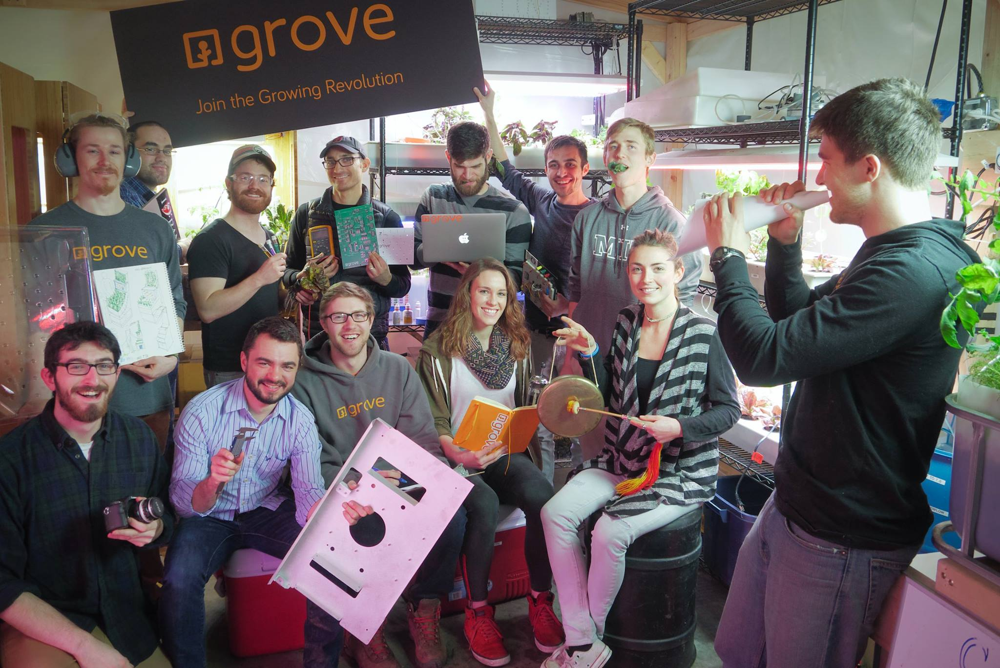

I had my first intern that January — Steph Northway, a cool cat from Olin College. Steph and I met each other over a twenty minute Skype interview during the winter holiday, at the end of which I extended an offer and she accepted. I also hired Charles Renwick, a recent college and coding school graduate from Seattle. Charles would go on to become a close friend, and roommate several months later. He also turned me on to [React](https://reactjs.org/), a JavaScript library for building user interfaces that was about to have its breakout year.

<figure>

<figcaption>
Charles, me, and Steph, seen here on a typical night at the office.
</figcaption>
</figure>

# Making the software, round 1

## Sparticle

When Mike Siegel joined Grove, I passed on the responsibility for writing new parts (and fixing the old parts) of the firmware to him. Chad and I had decided to build on a microcontroller called [~~Spark Core~~](https://www.kickstarter.com/projects/sparkdevices/spark-core-wi-fi-for-everything-arduino-compatible) [Photon](https://www.particle.io/products/hardware/photon-wifi-dev-kit) made by a startup named [~~Spark IO~~](https://blog.particle.io/2015/05/12/spark-is-now-particle/) [Particle](https://www.particle.io/). The platform and company were new and unproven, but it allowed us to use our existing code written for Arduinos and avoid having to implement low-level integration with a wifi chip and network protocols. Sprinkle in some `Spark.publish` and `Spark.function` calls and we had ourselves a network-connected device with a good abstraction.

Building on the Particle platform had its tradeoffs. They claimed that tens of thousands of products were shipping with Spark Core inside, but our day-to-day reality did not jibe with that. The recommended method for a customer to setup their device on wifi only worked about 50% of the time. The recommended recourse at that time was to _pre-program customers' wifi info into each unit_. So we did. We collected network names and passwords from everyone beforehand and loaded them into each tower on the manufacturing line. Inevitably we had typos (did **you** know Google Sheets strips leading zeros in a cell? 🙄). Several times we had to drive out to people's homes, plug in our laptop to their grove, and change the credentials manually.

Before we fully finished the firmware, we **ran out of room on the Spark Core**. The microcontroller had 128 KB of storage, of which only 70 or 80 were available for application code. We were down to less than three kilobytes of space. We had to hold off on implementing some features because they needed too much new code to implement. It was almost comical. _Almost_.

About a third of the way through our manufacturing, Particle started shipping their newer microcontroller, the Photon. It had 1 MB of storage, was cheaper, and had a wifi setup that actually worked. We did the work to port our system and thoroughly test it as quickly as we could in the middle of production. We went out and replaced all of the Spark Cores already in customers' homes.

## Meteor and Mongo

In the beginning of the product cycle I had been told that we needed an app that could run on iOS and Android. Since my strength was in web development, I had recommended to make a mobile web app, versus two native apps. That was how we began building with a full-stack framework called [Meteor](https://www.meteor.com/). We had decided to use it because it got us a lot for relatively little. It had incredibly easy setup, made making a dynamic web app easy, and had clear paths for making a real-time back-end. A lot of this magic was accomplished by coupling the architecture to a database called [MongoDB](https://www.mongodb.com/).

Meteor was a young framework and company. It hadn't even reached a self-proclaimed version one, yet. It had a half-baked story around testing and scaling. It had a magic, messy abstraction between client and server code. It used a lot of global variables. But we were facing relatively small scale, it's what I already knew, and I didn't fully grok the consequences of choosing a SQL or "NoSQL" (documents instead of rows) database. I placated my uncertainty in Meteor's new style of architecture by getting involved in the open source project and the Boston Meteor Meetup, even hosting the event at our office a few times.

<figure>

<figcaption>
Originally made for Worldwide Meteor Day 2014 😬 😅
</figcaption>
</figure>

## React

When Charles shared [Pete Hunt's original talk introducing React](https://www.youtube.com/watch?v=x7cQ3mrcKaY) with me, it resonated strongly. The web application front-end was approaching somewhere between 15,000 and 20,000 lines of code, the largest application I had built so far. The boundaries between parts of the UI were already becoming difficult to reason about. The predominant principle of building UI on the web up until this point was "separation of concerns" — dividing an application's components between structure, style, and logic, thinking about the application as sections of a document. Doing it this way had led to brittle, "magic" references in between files. Everything was still coupled, just across different file types and without guarantees.

React guided you to divide your application across logical boundaries and define clear interfaces between your components. The approach excited me so much that I moved to port our front-end to React within the first month of watching Pete's talk. I wrote and released [one of React's first integrations with Meteor's live data architecture](https://github.com/grovelabs/meteor-react) and guided the team to begin making a reusable component kit.

Later that year I would be invited to give a talk at the monthly Meteor devshop in San Francisco where I went into much more detail on all of this. (I was so nervous during that talk, my first in industry, that I looked at a picture of strawberries and obliviously called them tomatoes. Twice.)

https://www.youtube.com/watch?v=cctY_K5-Xyg

Overall I was amazed at the complexity and confusion involved in simply choosing the tools and services for shipping software. The sheer number of pieces to the puzzle and ways to arrange them is staggering. There were barely any clear answers or best practices for anything we set out to build because everything kept _changing_ so much. It took me a while to understand the historical context driving my anxiety over understanding how it all fit together.

The art and industry of making software has been changing since the creation of computers, but especially so since 2008. Cloud computing. Mobile apps. Continuous integration. Containers. JavaScript's big leap forward. The Internet of Things. The rise of open source everything. Nearly every sub-discipline of software engineering is undergoing significant change and improvement. Understanding and embracing that change promises a simpler way to make more reliable, usable software.

Building with new, open source platforms from startup companies was difficult. While they offered advanced features and visibility into the code, they did not necessarily offer stability or transparency into their priorities or thought processes. Sometimes it was a struggle getting the Particle engineers just to believe us when we found bugs. One time Karl and Siegel had to send a complete circuit and router setup to them in California to demonstrate a particularly tricky flaw.

What that meant for me was hours upon hours of reading blogs, watching talks, and reading documentation for tool after tool after tool. The concept of "industry standard" choices wasn't quite a reality yet, but it seemed like it would be soon — I just had to figure them out.

## Conflict in the software team

In late January, Gabe and I again failed to resolve a conflict within the software team. What started as a small disagreement over how to model some data grew into a full blown rift between Abigail and the rest of the team. My poor planning and our underdefined specifications had led us to removing a good chunk of her work when the design changed direction. She was frustrated with spinning her wheels and felt like she wasn't being respected. I was overfocused on my code contributions instead of articulating the plan and running the team. The data modeling disagreement was simply the final straw. Gabe tried to solve the problem by avoiding it, deciding that Abby would work on different code done almost completely remotely (she had been driving up from New York). This only exacerbated the coordination problem. She parted ways with the company shortly thereafter.

# Shipping my first product

The huge piles of snow eventually did melt. I took home a prototype and put it right next to my bed. Deadlines slipped. Problems arose. Our customers understood. We fixed the problems. Nick [wrangled the manufacturing](https://www.youtube.com/watch?v=BcmY7X5rStI). We assembled the groves ourselves. Spring came and went.

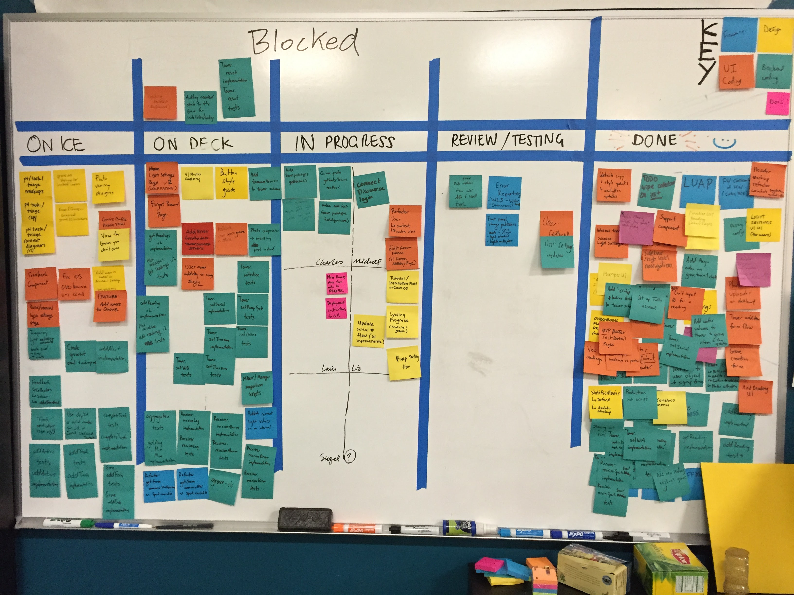

We delivered our first units at the end of May. I finally shaved the beard I had been growing since November. We continued delivering throughout the summer. Everyone took part in deliveries. Jamie and Tim [went on a cross-country roadtrip](https://www.instagram.com/p/7xrcb_w1B1/) installing groves at a handful of places around the country and spreading the word along the way ([#GroveTripUSA](https://www.instagram.com/explore/tags/grovetripusa/)).

We had more interns. We went on more retreats. Chad decided to leave for another startup. Steph joined full-time. Matthew Seaton and Arjun Varma came on as full-time ecologists. We hired someone just to run our social media. We had no head of marketing or sales, aside from Gabe. We had very little company structure at all. We relied on self-organization and self-accountability. Gabe and Jamie tossed around terms like "holocracy" and multi-part Venn diagrams when describing their vision for how the company should be organized. It was their nature to question and innovate everything. Neither of them had ever had jobs at a traditional company, and both believed that traditional business offered more warnings than lessons for how to run their company.

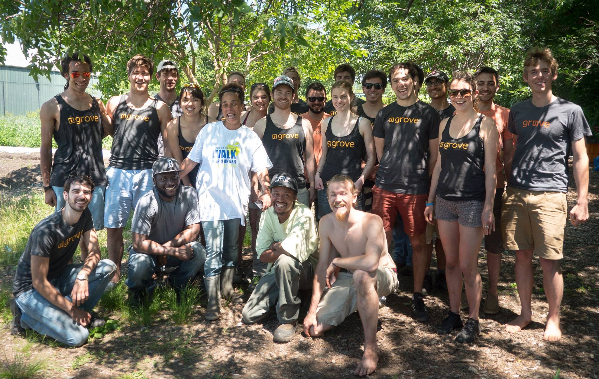

## Customer love

One of the most unique parts of Grove was how often we would hear from people who absolutely loved what we were doing and supported us wholeheartedly. Building a movement and a product that centered around Nature connection meant frequently coming into contact with extremely kind, concerned, and compassionate people. We would get messages out of the blue almost daily encouraging us. Folks from all over the world wanted to know when we were shipping to their country, wondering what they could do to get their hands on a grove **now**.

That was no more true than with our early adopters. Many of them were posting frequently on our forums, eagerly sharing their fun and failures. It was one of the most satisfying feelings in the world to watch. The [first baby was born into a home with a grove](https://www.youtube.com/watch?v=jWZe2xrqWEA). One woman told us about how she would talk to her plants every day, telling them what a good job they were doing. One father and son [started a small YouTube series](https://www.youtube.com/playlist?list=PLDn5j59RTWJlpq_yPIePZy4NxDv19pqo2) cataloging their experiences. Customers adored their groves.

https://www.youtube.com/watch?v=jRAK3tnJK5I

# Running out of money, pt. 1

Around the end of summer we found ourselves just about out of money. While we had put out a product and were seeing happy customers, when it was all said and done we were losing around **$2,000** on each tower sold (a single system could have one, two, or three towers). We were not seeing much revenue at all from selling supplies, either. It became clear that it was not a plausible idea to sell this version of the product on even a regional scale. We needed to redesign. We needed more time. We needed more money.

Our investors gave us more money, around $1.5 million more, but this time they tranched it. We would receive half now, and the other half after obtaining $600,000 in revenue. Our new estimated runway was less than a year long. We had to redesign, we had to have a crowdfunding campaign, and we had to do it _now_.

The [first thirty seconds of this video](https://www.facebook.com/GroveLabs/videos/1197171806964932/) give a sense of the atmosphere within the company at that point. We were still riding the wave from our first product and thought we could do no wrong. Sure, it was having some problems, but people loved it. And Nate was already working on exciting prototypes of a great new design.

We decided to go for it. We were exhausted, we were stretched thin, and we were going to do it all again. But this time, _**even bigger**_.

# Kickstarter

The [Kickstarter for the Grove Ecosystem](https://www.kickstarter.com/projects/grove-ecosystem/grove-ecosystem-grow-fresh-food-in-your-home) took place from November 2nd to December 10th of 2015. We went all out. We hired a public relations firm. We hired a head of marketing, Marcos Rocha. We hired a design and marketing freelancer, Matt Lowe. We got in direct contact with the team at Kickstarter and installed an Early Adopter Ecosystem at their office in Brooklyn. We had a special reveal party for our early adopter customers where [Arjun laid down a sick beat about aquaponics](https://photos.app.goo.gl/zlzYfsYgFB0b0R3n2) and we arranged for each of them to upgrade to an Ecosystem for practically nothing. We promised them that we would exchange their EA Ecosystems, refurbish them, and donate them to a school.

The hardware team worked magic, producing looks-like, works-like prototypes in less than three months. We made sexy software demos that walked people through the system and showed off the new full-spectrum lighting design.

https://www.youtube.com/watch?v=P6qQjADFYhE

I vividly remember standing over Matt's shoulder as we launched the project, squealing with excitement. I was backer #1, buying the first Ecosystem for my parents in Houston. That night, we hosted a launch party at our office where we celebrated and danced the night away with a couple hundred of our fans, friends, and family.

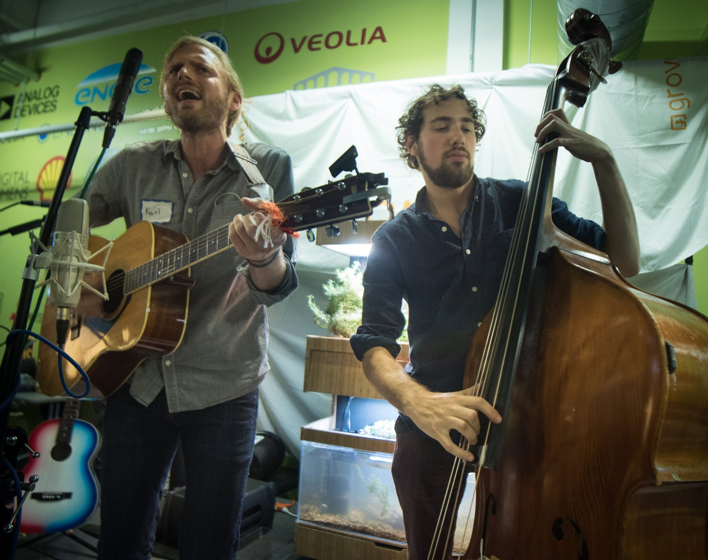

Over the course of the campaign we hosted four more parties across the country in San Francisco, Boulder, Seattle, and Brooklyn. (I wouldn't attend any of them, staying behind to work.) We [garnered](https://www.engadget.com/2015/11/03/grove-ecosystem-aquaponics-kickstarter/) [more](http://www.businessinsider.com/grove-lets-you-grow-food-at-home-2015-11) [press](https://www.fastcompany.com/3052682/this-intelligent-indoor-garden-for-your-house-grows-greens-all-year-round). By the time it was all said and done we had over 500 backers and $400,000 in pre-orders.

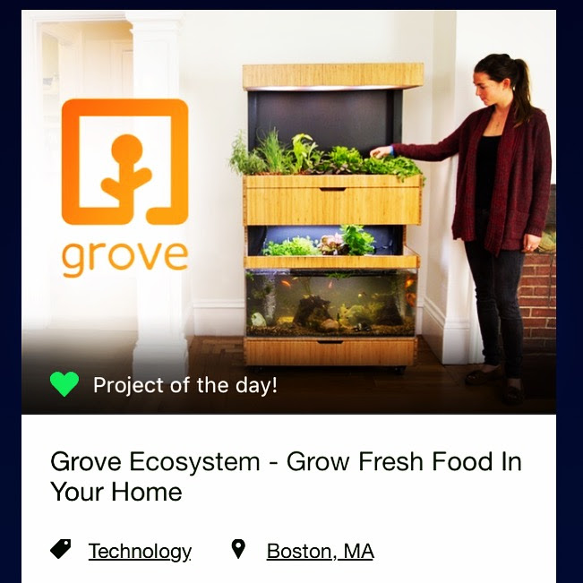

# Making the software, round 2

As part of making the Ecosystem we decided to scrap ongoing development of the Early Adopter Ecosystem. For the hardware team, that meant not manufacturing any more units. For the software team, that meant not developing any more features or fixing any more bugs. This was particularly painful for me. Key features were still half-complete. The app was objectively frustrating to use in some spots (the sliders for changing the lights 😰). We had barely gotten the app into people's hands before being pressured to forget about it and make a new one. The majority of what we had written so far was now technical debt.

## Web app: out. iOS app: in.

Making a mobile web app did not turn out like we had hoped. Touch interactions were janky; animations jittered. Overall, it just felt cheap. Making a web app that feels as good as a native app is still not possible, to this day. We decided we wanted more polish. We also decided we were alright with only doing iOS, that we would literally send a free iPod touch to any customer who didn't have an iOS device already (if only we had reached that conclusion the _first_ time... 🙄)

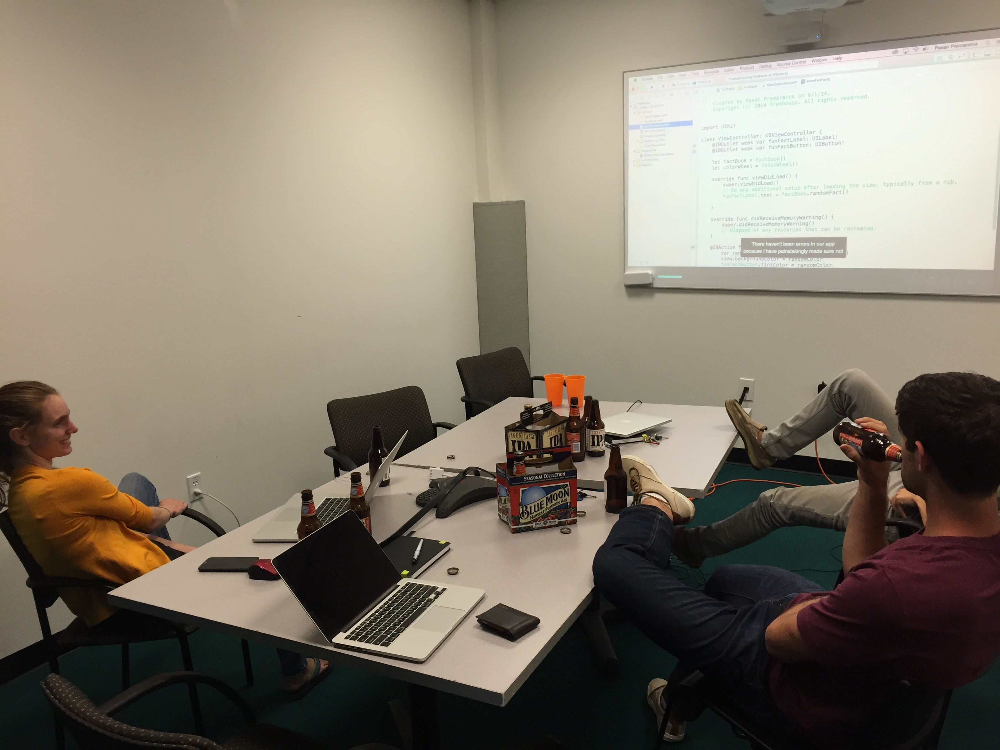

## Meteor: out. REST API: in.

Within two weeks of giving my talk in San Francisco we stopped using Meteor. The back-end was extremely coupled with the front-end, and we were getting rid of the front-end. When I ran into a senior Meteor engineer at a conference earlier that summer, he literally laughed when I asked about when the poor testing situation was going to be straightened out. Their roadmap had more churn in store, not less. We decided to use a paid service for real-time data instead of building our entire architecture around it. We built a REST API using a small server library called [Koa](http://koajs.com/).

## Mongo: out. SQL: in.

[Going to MongoDB World](https://twitter.com/louisdescioli/status/605460869355589632) earlier that summer had been an eye-opening experience. Aside from being my first tech conference, everyone there kept asking each other in puzzled tones, "Why are _you_ using Mongo?" Only after hearing that for the tenth time did I realize the other implicit question being asked was, "Why _aren't_ you using SQL?" After moving off of Meteor, I didn't have a good answer for that. We used Postgres the second time.

## Michael leaving

Michael decided some time that fall that he'd had enough. I was completely caught off guard the day he told me. There was nothing I could do to convince him to stay. I was very sad when he left. He was my friend, my first hire, and had been my right hand man through many memorable and difficult times. He'd kept me humble in simple ways, like the sign on his desk ever posing the question, ["Who's the more foolish, the fool, or the fool who follows him?"](https://www.youtube.com/watch?v=x0ow4X8tiMI)

Even before Michael left, I had decided to take a different approach to the software team's strategy this time around. Instead of everyone being generalists, we would specialize. Siegel owned the embedded system, Charles and Steph owned the front-end, and Michael and I owned the back. With him leaving, the back-end and operations were now solely my responsibility.

## Leadership struggles

We spent a good amount of time that fall trying to recruit a senior software engineer and meeting with potential agencies. I was very open about wanting more mentorship and experience on the team. Having no senior leadership was the worst part of Grove for me. Mike Zartarian, who was effectively our CTO, had very little faith that me, Charles, and Steph could build a new and improved app and back-end in time. At one point he tried to get Gabe to replace me (a detail I didn't learn until months later). Gabe's direction on the issue swung drastically from week to week. One week Mike was head of the software team and I needed to run everything I did by him. The next week Gabe was the head of the software team, and Mike was not to have any participation. At one point I openly challenged Gabe to either trust me or fire me after he questioned my basic competence in a meeting with Liz and Siegel. He decided to trust me.

The ordeal was painful. It emphasized how essential clear communication is on a multidisciplinary team. I had scarce oversight during the first product cycle. This time I had been forced to rigorously justify and prove my system design. It is not easy to do that for people who aren't versed in the technical minutiae of your skill, no more so than in software. It underscored the value of having advisors and mentors who can vouch for you, especially as a young engineer. During this time I started a relationship with Jesse and Ashley Streb, two respected engineers and entrepreneurs in the Boston area whom I'd met through the Boston Node.js Meetup. Over the course of building the new app and back-end, they came into the office a few times to listen to my team's design decisions, provide feedback, and answer questions. Their advice and encouragement was helpful for me and my team, and helped ease Gabe and Mike's anxiety over the soundness of the system.

# The E-team

Gabe and Mike's scheming and passive aggression were fresh in my mind when the company went home for the holidays. Our struggles over the software team's leadership was one of several issues the company was having with communication and cross-team decision making. I discussed all of this with my family. My Uncle Tom pointed out the fact that the company did not have an executive team, or even really a board. Aside from Gabe and Jamie, the board had only one other member — a junior partner from our lead investor that had never run a company. He gave me a book, _The Five Dysfunctions of a Team_, that he used as a framework for understanding leadership issues in his management consulting.

When I came back from my vacation I went to lunch with Gabe and Jamie and started a discussion around maturing the company's leadership structures. We discussed the egalitarian, self-organizing approach we had used so far and how it was beginning to fall apart as we grew in size. I gave Gabe the book and [this talk from the author](https://www.youtube.com/watch?v=inftqUOLFaM). After skimming the book and having a couple more discussions about it, both of them agreed. That January the executive team was created (quickly shortened to just the "E-team"). On it were were Gabe, Jamie, Mike, Liz, Emily, Marcos, and Dave.

# Getting into the App Store

With some company accountability in place, me and my team got down to business. The plan was to ship the first few Ecosystems at the end of May, so we wanted to have our app submitted to the App Store by April 1st to be able to user test the full setup experience for at least six weeks. A new back-end and a new app, integrated with new hardware, with three engineers and one designer, in three months. We had our work cut out for us.

There were more long nights. More 80+ hour weeks. Another shave-less winter. I was working on a clear plan on a product I believed in, for people who really wanted it, on a fun team with everyone giving their all. I loved it. I was in my flow.

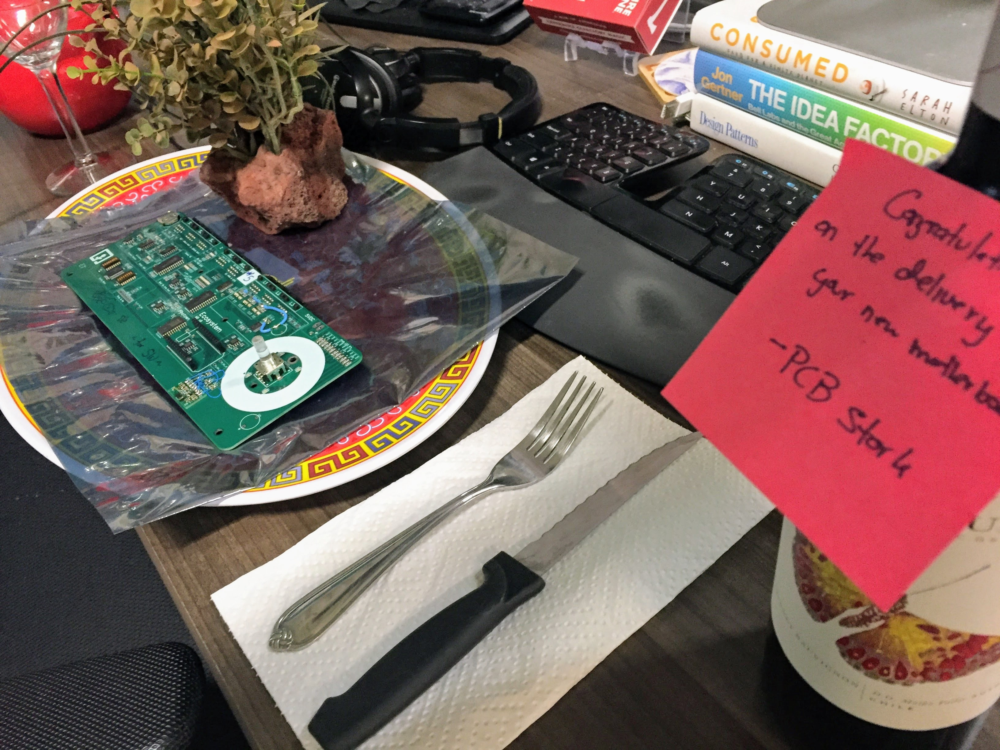

On April 1st, [we submitted the app](https://photos.app.goo.gl/AHY50WCPmKtJ1Wul1). Six days after that, Grove OS was in the App Store. The app was accepted on our first submission. We had a great new UI that was simpler **and** more informative. We had much more thorough guidance. My back-end systems had 100% test coverage, with much improved application monitoring and continuous integration. I even made a web app for our team to be able to easily check-in on a grove, where we could see their data and send a customer a message, reminder, or task. I called it "Roots". We had delivered on time and under budget.

# Downsizing

While the software team was hard at work, the executive team had been forced to make some difficult decisions. The company's burn rate was too high. We had around 25 employees. We had spent a good amount of time and money trying to become a benefit corporation. Sales had been a slow trickle since the Kickstarter. We would not have enough money to fulfill orders at the pace we were going. Leo, our social media manager, was let go. We ended our contract with Matt. Tim was moving on as well. Marcos was let go. And then on March 31st, Arjun was let go.

The way Marcos had been let go was problematic. Gabe and Jamie had made the decision unilaterally, without consulting the rest of the executive team. Since Marcos was on the executive team, they didn't know how to broach the subject with the other members. The day they made the decision, Gabe informed Marcos and then left for a business trip right after without telling anyone what he and Jamie had done. Marcos came to work the next day and was the one to tell the rest of us what had happened. Of course this frustrated the other members of the executive team. They reprimanded Gabe and Jamie for making personnel decisions in isolation, and the two of them promised not to do it again.

Less than two weeks later, they did it again with Arjun.

Letting Arjun go had a deeply negative impact on morale. He was an incredibly hard worker and beloved member of the team. He was contagiously optimistic and consistently went above and beyond the call of duty. In addition to his role as an ecologist running the research farm and testing prototype systems, he handled a large amount of customer support. He drove out to many of our customers' homes, fixing the issues that all of the EA Ecosystems were beginning to have. He helped maintain all of the publicly installed groves and spent hours on our forums thoroughly answering people's questions, more than anyone, except perhaps Matthew. The reason that Gabe and Jamie gave for letting him go was that he wasn't carrying his weight. This did not jibe. The uncomfortable truth was simply that we were spending more money than we could afford and needed to bring that number down, and fast.

The Friday night after Arjun was let go, I hung out with him, Matthew, and Nate and learned about what had been going on within the ecology team. It was not good. I heard story after story of Jamie's failings to follow through on his commitments and provide basic leadership.

I talked with the other people on the executive team and attended their next meeting to find out what had been going on. There, we worked through the uncomfortable details that had been revealed about Jamie's leadership failures, and together came up with solutions and commitments that would try and address them. After that, I pressed the team on what our sales and marketing strategy was now that Marcos was gone. We only had till June 1st to sell another $100,000 worth of groves to unlock the next tranche of funding, according to the agreement made with our investors the previous fall. When they didn't have an answer, I asked to step up and lead that effort. I had been heads down at my computer for many months, working on some of the company's most invisible work. I wanted to get out there and hustle. Nobody had a good reason why not, especially since we didn't have the budget to hire anyone else. They granted my request. I was now the head of sales.

# Sales

I began my role in sales the same way I had started at Grove — reading. I had a lot to learn and not much time. I started with _The E-Myth_, as recommended by Mike. I read _Crossing the Chasm_ and _Disciplined Entrepreneurship_. I also got a crash course in sales and entrepreneurship from my girlfriend, Katie MacDonald. She was the executive director of the northeast division of Cleantech Open, where it was her job to train new entrepreneurs in the fundamentals of marketing and sales (among many other things). Almost every night of my first week in the role, she schooled me in the basics of doing market research, finding sales channels, and establishing product-market fit. She ran me through deck after deck, giving me homework, assigning me cases and books to read, illuminating the full scope of what I was up against.

I met with several advisors and mentors that I was connected to through Katie and the Greentown Labs network. My most memorable meeting was with Ben Einstein, the founder of [Bolt](https://bolt.io/). After I described the product to him, discussing its value proposition, size and weight, price point, and cost of goods sold, he told me without equivocation that it was the hardest product he could could think of selling.

"Well, no one said it was going to be easy," I replied.

One of the first steps in leading the sales team was aligning the people on it. It consisted of three folks — Brooks, Emily Roberts, and Elias Kolsun. Brooks was a videographer and photographer, and was much more involved in marketing than sales. Emily was a senior in college, working for grove part time. She had been brought on in January to nurture the relationships with the handful of schools that had groves. Elias was an urban agriculture veteran, also working for grove part-time. He had been brought on in December to help with sales, but had clashed over marketing strategies with Marcos and hadn't been allowed to pursue his ideas. He was the only one on the team with sales experience. Much of my time leading the sales team was learning from him, harnessing his ideas, and acting on the opportunities he created.

We figured out a rough sales plan. We tried to recruit our first salespeople. They quickly made clear how much we still needed to figure out to sell groves in-person.

* How would people get service for their grove?
* How could people finance the purchase?
* What were the sales materials?
* How did a salesperson demo an Ecosystem?
* Where should salespeople focus?

We scrambled to answer those questions, and to just sell some units. We had a little less than $100k in revenue left to get to our $600k goal, which came out to less than 25 more sales. We worked every existing lead we had. I cold called everywhere from nursing homes to coworking spaces. Gabe and I met with a few home contracting companies. Emily got in touch with every teacher who had ever expressed interest. Jamie called every person he'd met on his roadtrip. Elias worked his contacts and tried to get us a deal.

## Mr. Ritz and the [Green Bronx Machine](https://greenbronxmachine.org/)

One of the most exciting opportunities we had was with a man named Stephen Ritz. Stephen is an amazing teacher in the South Bronx who has made a name for himself practicing Nature-centric learning in his classroom to great success.

https://www.youtube.com/watch?v=H7uFnvnjIKw

Stephen had met Gabe and Elias at an event earlier in the year. After hearing Gabe speak on a panel, he approached Elias and expressed interest in collaborating in some way with Grove.

One of the first opportunities for that collaboration was the opening of the [National Health and Wellness Center at C.S. 55](https://greenbronxmachine.org/projects/the-national-health-and-wellness-center-at-ps-55/). They had been transforming an old, empty library into a "an innovative and engaging wonderland" for the better part of a year, and it was going to have its grand opening in May. I learned that we had the opportunity to sponsor the Green Bronx Machine and give them an Ecosystem for the debut. I lept at the chance.

The hardware team responded heroically to the call to have Ecosystem #1 ready for Mr. Ritz. They made extraordinary exceptions to their plans to have a special unit completed in time. Nick later told me he's never pushed himself as hard as he did for that delivery, which is insane if you know how hard Nick works. On the last Friday in April, six of us drove down to New York City and delivered the first Ecosystem to Mr. Ritz in person.

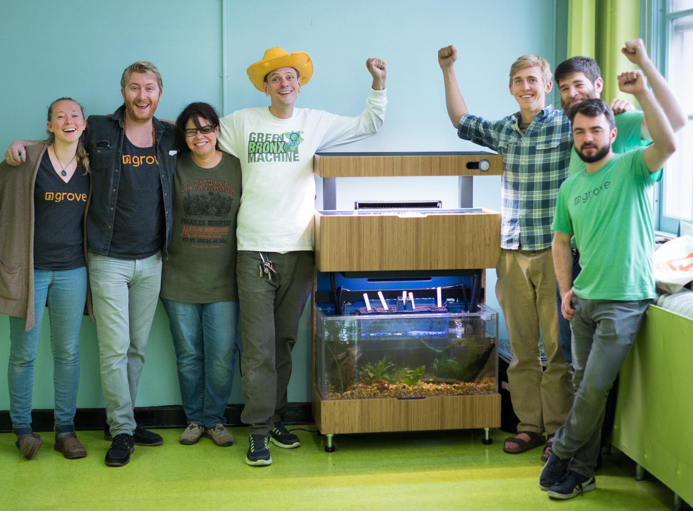

## Half-pay May

The excitement of the Ritz delivery withstanding, the company was on tough times. In order to keep making some progress on producing Ecosystems and to make it to the end of the month, everyone took a 50% pay cut. Gabe and Jamie took no salary at all.

For all of the hype and excitement we had around our partnership with Stephen Ritz, it didn't turn out any short-term sales. This was understandable. The Ecosystem hadn't really been used in their classroom, yet. We did return for the classroom's grand opening. We shared in the celebration of their milestone and made many good connections with the other sponsors there, but the partnership was in its infancy. It had great long-term potential, but not the kind of two-week turnaround I had foolishly hoped for. I kept cold-calling.

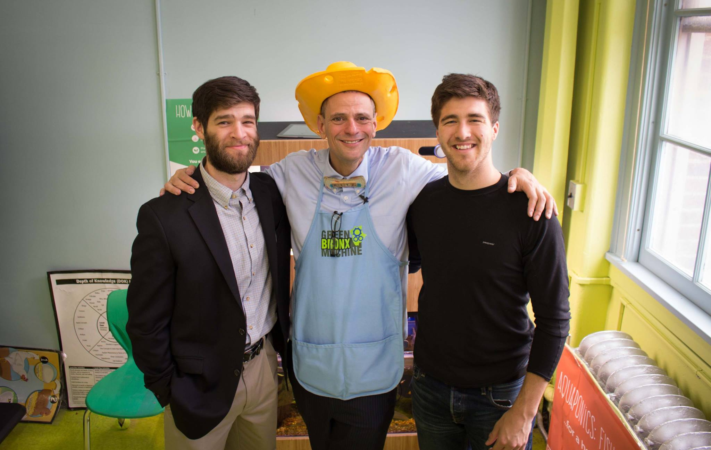

It had become very clear to me that the hardest part of our business was not designing or building the product, but actually selling the thing. I understood that to succeed on the vision of putting a grove in every home would take a masterful leader with practical experience selling and servicing a hardware product. After working closely with Gabe and Jamie for the month, I was convinced that neither of them were that person. According to the books I'd read, that was ok, and even to be expected. Starting a company takes a different skill set than scaling it.

While Gabe and Jamie were away at a conference, I met with each of the other people on the executive team to discuss finding new leadership (I had become an "interim" member when I became the head of sales). Everyone tentatively agreed it was necessary, but no one wanted to rock the boat while our next tranche of funding was up in the air. We decided to wait until funding was secured before doing anything.

On May 23rd, the morning before Gabe and Jamie had a meeting with all of the partners at our lead investor's office in Los Angeles, we sold our 180th Ecosystem, putting us past the $600k threshold. We crossed our fingers and hoped our investors would hold up their end of the agreement. They held off on giving a clear answer during the meeting, leaving us all on pins and needles for the rest of the day. Kevin, our board member, confirmed that they would while at dinner with Gabe and Jamie. Just past midnight, we got word from Gabe that we would live to see another month.

# Difficult conversations

I woke up the next morning more nervous than I'd ever been. Gabe and Jamie were flying back on a red-eye and we were having an all-hands meeting that afternoon. I didn't know what they were going to say, but I knew what everyone else wanted to say — we need a hard reset. I didn't know how to tell them that they'd lost their team's confidence. I didn't know if I could.

After our all-hands meeting, where I grimaced in response to Gabe's announcement that we would proceed with "business as usual", I decided I had to be honest with them and with myself. First, I went on a walk with Jamie and told him about the conversations I'd had about replacing him and Gabe. Then I went on a walk with Gabe and told him the same. They are two of the most difficult conversations I have ever had.

Both of them responded with surprising humility and candor. Each of them openly admitted that they had discussed the same thing between themselves, and acknowledged that significant change was needed if Grove was going to live up to its potential. They were not angry. They were appreciative. Gabe displayed a determination that softened me. He asked me whether or not I believed that he could be the leader to take Grove the distance. I told him that if he truly committed to changing and we got him an executive coach, yes, I did.

# Uncomfortable changes

The next day, we started the process of rebuilding trust and accountability within the team. Liz led everyone in a [SWOT analysis](https://en.wikipedia.org/wiki/SWOT_analysis) that prompted lots of reflection and honesty about what had been going on. As a group, we committed to more focus, accountability, and structure.

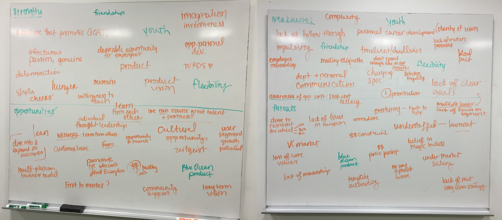

We started to take steps to address our weaknesses. We had a series of discussions figuring what our mission was (and what it wasn't). We hired an executive coach for Gabe. We started to put together the company's first organizational chart, defining people's roles and responsibilities more clearly. We identified where we needed the most help. We plowed ahead with manufacturing.

For the sales and marketing team, we paused on selling to research product-market fit. The past two months had been a tough balancing act of scrambling for any and every sale while trying to learn the "correct" way to sell a product. Now we had time to do it right. I led us in doing dozens of customer interviews, testing our assumptions, and figuring out which one or two markets should have our focus.

A major part of that research was finally figuring out whether schools were a viable sales channel. Over the next few weeks, my team and I interviewed a couple dozen K-12 teachers and administrators. I learned about the new federal science standards being rolled out called [the Next Generation Science Standards](https://www.nextgenscience.org), and how they centered around hands-on experiences, cross-cutting concepts, and systems thinking. I listened to head teachers as they walked me through exactly what types of curriculum and professional development they would want alongside an Ecosystem. I heard from superintendents about what their budgets were, how long their sales cycle were, and where they got their information on new educational technology.

# The last straw

Two weeks into June, on a Friday night while I was home in Texas for a friend's wedding, I checked my Snapchat and discovered that Gabe had posted a video of our new, unseen org chart. It was ten seconds long, a quick pan of the "Grove Guidance Tree" he had made on his computer. Here was this sensitive company document that I was seeing for the first time on Gabe's semi-public Snapchat story. The new hierarchy did away with the executive team, replacing it with a three-person group of just Gabe, Mike, and Dave. It had Jamie off to the side, reporting only to Gabe. It demoted me and shifted several other people around. I decided then that I'd had enough.

# Leaving

I gave Gabe my notice the following Tuesday at lunch. He acknowledged the disrespect and carelessness in his action and apologized, but understood that my choice was about much more than just the video. We reflected on all we'd accomplished together. He confessed a bit of excitement for me as I figured out what my next move would be. It was intensely bittersweet.

He asked me to prepare a presentation for him, Mike, and Dave on the sales team's research and my final recommendations. In that presentation I laid out the case for making a hard turn towards schools as Grove's primary focus. We hadn't fully completed our market research, but it was becoming more and more apparent that we had a unique opportunity given the new federal science standards. Schools had a need that we were well-suited to fulfill. There were significant hurdles to overcome, but I believed then and now that achieving the culture change we were looking for must start with education and children.

As part of my final meeting with Gabe, Mike, and Dave, they denied my request that we not tell the rest of the team of my leaving until a week and a half later, just a few days before my last day. I wanted the sales team to finalize our research, and I knew that telling them would derail the whole thing. They told me that I was to tell the team at an all-hands meeting later that day. They said the research was done, and that after handing off all of my technical responsibilities I was welcome to use my last two weeks of time for myself.

Instead of checking out for my last two weeks, I went back to the software team. I moved my stuff back next to Charles, Steph, and Liz. I spent my final days at Grove redesigning and adding features to Roots, our internal web app, and eating as often as I could from the GURF.

# Saying goodbye

After my final meeting with Gabe, Dave, and Mike, I had a little over an hour to figure out how to say goodbye. I walked out into the Greentown courtyard, sat down, and wrote down this poem. I didn't last a minute reading it to the team before I choked up.

> **A Resignation Letter**
>
> Eight hundred and eighty nine days since I first stepped into this office
> And after 2 products, 2 apps, & 5 million dollars, the time has come for me to cut my losses
>
> I took some time last night to look back to the past
> To remind myself that regardless of what's happened, it has been a blast.
>
> I saw the first email, the first "fuck yeah, let's do this"
> Let's build Grove OS, in 4 weeks! Ah, such ignorant bliss.
>
> I found the first commits, good 'ol Ruby on Rails
> I found the first time we Hipchatted about snails.
>
> I found your applications, the days we met each of you
> It's hard to understand exactly how much we've been through.
>
> I looked at old sketches, the systems Nate first designed
> I smiled and laughed, seeing the Ecosystem's always been in his mind.
>
> I thought back and counted the good people who have come and gone.
> I even went back and listened to Arjun's rap songs.
>
> I know there are reasons why each one of them had to go
> This is a startup, a revolution — I just wish it wasn't so.
>
> It's no secret that we're all a little more than colleagues
> The long hours, the late nights; a team band led by Siegs
>
> I want you to know how much I respect and love you all
> The friendships, the memories — I'll cherish them all
>
> But as of late, I've grown angry. Frustrated. Tired.
> Seeing so many problems, repeated. Not feeling inspired.
>
> I haven't been bashful, in fact nothing of the sort.
> I've said we need leadership, we need structure, through which we report.
>
> We need a mission, we need research, we need product-market fit.
> We need a lot more than we're willing to really admit.
>
> So as we turn towards the tarmac, another runway to try and take off
> I've realized that for me, it's my time to get off.
>
> I've got aspirations, lots of skills I've accrued
> I must test myself, get out there, see how much I really care about food
>
> No longer a teammate, now just a fan
> My options, probably worthless. Can't afford to buy them. Damn man.
>
> But regardless the circumstances, I believe in y'all no less
> You have it in you, I know it, but there are major problems to address
>
> I'd talk about them now, but see, I've run out of time
> Off to Taste of Somerville to sell groves, although it's no longer mine
>
> My final words are simple, as I look around at each of you
> From the bottom of my heart, it's been an honor. For everything — thank you.
