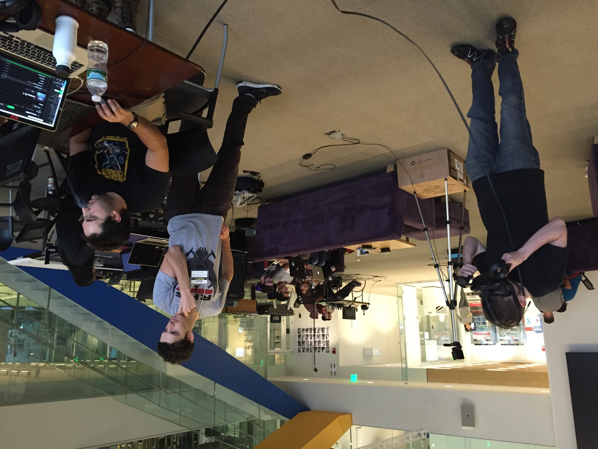
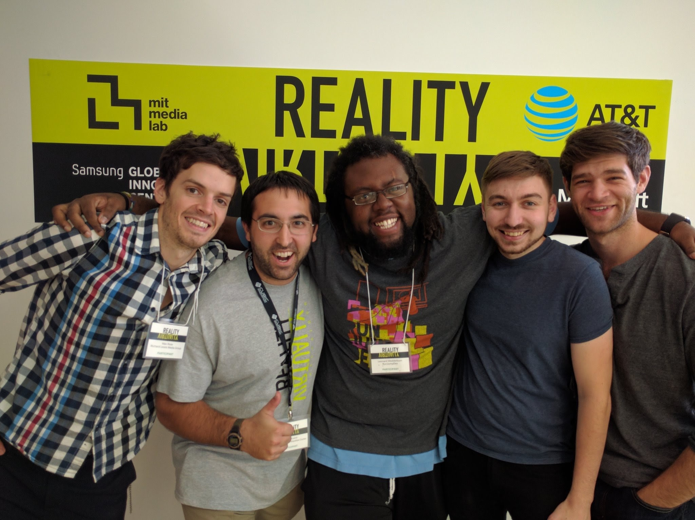

From October 7th to the 10th of 2016, I participated in the MIT Media Lab's first [Reality, Virtually, Hackathon](https://www.realityvirtuallyhack.com/). It was my first time designing or developing a 3D experience of any kind, let alone a virtual reality one. Over the course of the weekend I got a taste of building with Unity, 3D modeling, and programming in C#, and a hefty dose of excitement for virtual and augmented reality. More importantly, I met many kind, creative, and helpful people that weekend who inspired me about what the future of immersive technologies like virtual and augmented reality can hold when they're used for making meaningful and magical experiences.

I was a part of Team ZeeGee with the excellent Max Rose, Daniel Bryand, Alan Foster, and Leonard Wedderburn. We made a virtual reality experience for the HTC Vive that was an entertaining experiment around locomotion and interaction.

# Frisbee in low gravity

Our original goal had been to make a low gravity ultimate frisbee-like multiplayer game, but we quickly understood that would be out of scope for the five of us to make in two days. We limited our scope to building the environment, and nailing the physics for locomotion and the frisbee. Our final product was a low-gravity space environment where you could fling yourself from platform to platform throwing frisbees.

https://www.youtube.com/watch?v=MmeWOyucehQ

Aside from the frisbee, all of the items in the environment were created using [Google's Tilt Brush VR application](https://www.tiltbrush.com/). We were delighted at how simple it was to export designs from Tilt Brush and import them into Unity. Max was even able to rig up the human spaghetti figure and add some animations. The pedestals for the frisbees and the floating coils were some of my creations. 💁‍♂️

# Crash course in VR interaction design

The whole weekend was a crash course in the nuance and difficulty of VR interaction design. Every interaction needed thorough consideration and testing of the physics behind it. Some of the questions we found ourselves wrestling with:

* How _do_ the physics of a frisbee work?
* What should it feel like to float through empty space in low gravity?
* How should it feel to be able to reach out, grab the air, and throw yourself around?

The initial version of the frisbee and locomotion physics were surprisingly quick to implement. The majority of the work was in tweaking and testing, (and reading research on frisbee physics). We made ourselves nauseous more than a couple times trying to figure out the best parameters for locomotion; spinning around in six degrees of freedom in virtual outer space will do that to you. 🤢 It all paid off though — none of the people who tried out our experience reported feeling sick! That may seem like a low bar, but for an experience with this much motion, made and tested in less than 2 days, it was a proud achievement.

One of my key learnings from that weekend was that the goal when designing for virtual or augmented reality should not be to mimic reality exactly, but rather to create what _feels_ best. More often than not, an experience with 100% accurate physics simulation is difficult or uncomfortable. For instance, learning to navigate a low-gravity environment takes months of training, and even then it is still an arduous task. Making it drastically easier by adding the ability to stop dead in your tracks by squeezing the triggers was a good addition. Restricting the degrees of freedom of your motion motion so you can't accidentally start spinning yourself was necessary. I went in with the notion that realism is the ultimate goal, and came out understanding that it certainly is not.

# Best Interactive Hack

Our project won the [Best Interactive VR award](http://www.realityvirtuallyhack.com/winners-2016/) for the hackathon, earning each of us a PlayStation VR. Cheers Sony 🍻

You can find our [source code on GitHub](https://github.com/sirerr/zerograv) and [our very sparse project write-up on Devpost](https://devpost.com/software/zeegeeball). The source code is completely functional as of the writing of this story. If you have an HTC Vive you should be able to download the repo, build the project in Unity, and run it on your device. Feel free to get in touch with me if you give it a try and are having trouble.

